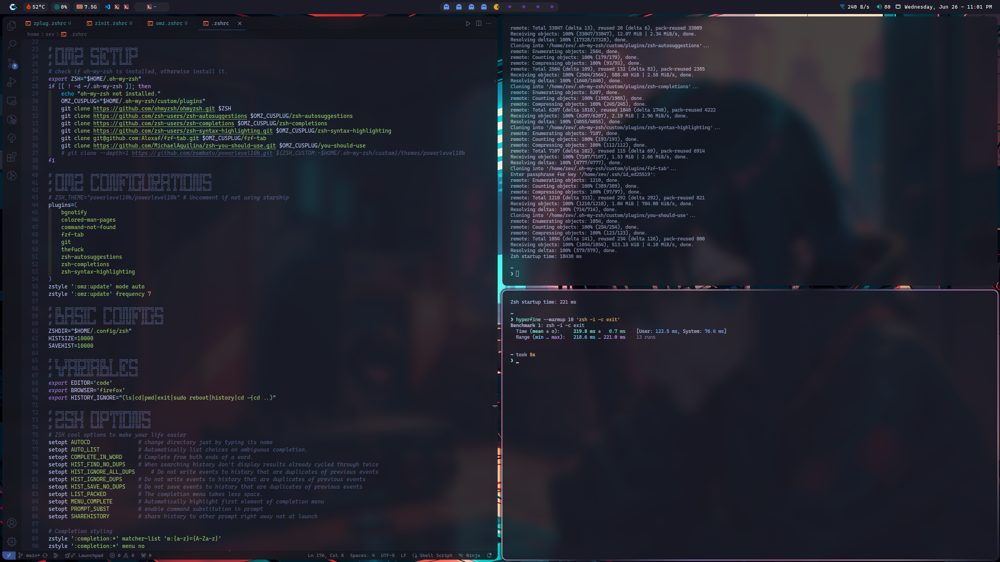

I decided to work on my dotfiles and found that zplug the plugin manager which I used for the past years, has been slowing me down 🤣. 

I tested 3 ways of managing the plugin manager `zplug`, `zinit`, `ohmyzsh`. And found that despite a lot of people saying omz is bloated. It's comparable to `zinit turbo mode using ice`, and faster without `zinit turbo mode` even without `ohmyzsh`. I also test it with heavy plugin (nvm) and `oh-my-zsh` still "comparable" to `zinit`.

`zinit ice` load plugin at the later time to make the startup time faster but at the cost of not able to use the plugin loaded with ice at the 1st cmd. That's why in the config I didn't use `ice` on zsh-completions, zsh-autosuggestions, and zsh-syntax-highlighting, because If I were to put those in `ice` mode all of those plugin won't be loaded, so if say I type "h" the last command `hyperfine` won't show up.

## Test basic plugins with I often use.
* zinit `255.9 - 261.2 ms`

* zinit with ice `215.5 - 224.0 ms`

* ohmyzsh `218- 221 ms`

* zplug `365.7 - 372.4 ms`

## Test with nvm plugin from ohmyzsh

* zinit+nvm `478.5 - 483.9 ms`

* zinit+nvm with ice `216.0 - 221.2 ms`

* ohmyzsh+nvm with lazy load on the nvm plugin `217.1 - 223.3 ms`, without lazy load `449.1 - 456.6 ms`

* zplug+nvm `634.9-642.2 ms`

